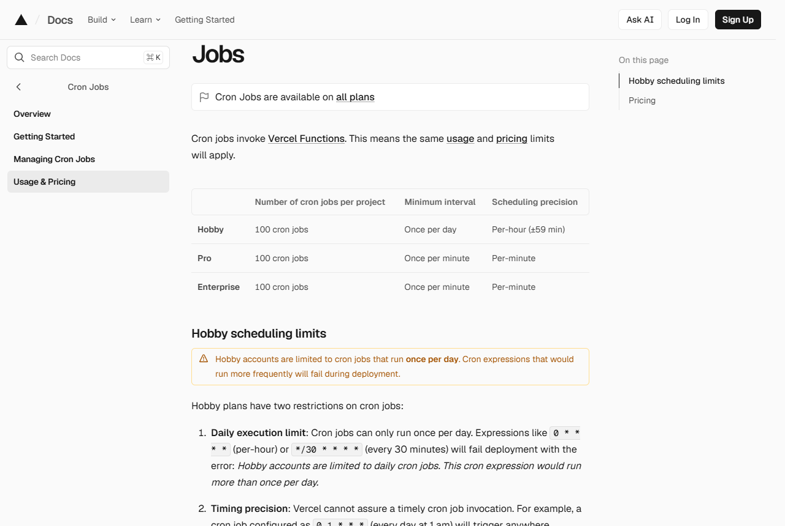

<!-- 제품 이름 확정(2026-09-16): 「이폼사인 방명록」. -->

# 매일 아침 기록 받아 보기 (설정 대행 서비스, 유료)

어제 들어온 방문 기록을 **하루에 한 번 모아서** 담당자에게 보내 주는 기능입니다.
이 기능을 켜지 않아도 기록은 그대로 쌓입니다. 다만 볼 때마다 이폼사인의 **문서 관리** 화면에 직접 들어가야 합니다.

이 기능을 직접 켜려면 연결 열쇠(API 키) 발급, 설정값 입력, 받는 방법 연결까지 몇 단계를 거쳐야 합니다. 그 설정을 대신 해 드리고 이후 문의까지 봐 드리는 것이 유료인 부분이며, 켜는 방법 자체는 이 문서에 전부 공개되어 있습니다.

**자격 조건.** 이 기능은 **API를 제공하는 요금제**에서만 쓸 수 있습니다. 지금 쓰는 요금제에서 되는지 궁금하면 계약 담당자에게 물어보세요.

> 이 문서의 설정 이름은 **맨 위 폴더의 `README.md` 표를 따릅니다.** 두 곳이 다르면 `README.md` 쪽이 맞습니다.

---

## 1. 무엇이 오나

하루에 한 번, 어제 하루치를 모아 이런 내용이 옵니다.

- 모은 기간(어제 0시부터 밤 12시까지)
- 어제 들어온 **건수**
- 들어온 **목록** — 문서 이름과 들어온 시각

### 표의 칸은 서식을 따라갑니다

이 화면은 어떤 서식이든 띄울 수 있어서, 서식에 무슨 칸이 있는지 미리 알 수 없습니다. 그래서 표의 칸을 **그때그때 서식에서 만들어 냅니다.**

- **늘 있는 칸** — 완료일 · 문서 이름 · 서식 이름 · 걸린 시간(분)
- **서식에서 오는 칸** — 그날 들어온 문서에 있던 칸 이름 전부

그래서 서식의 칸을 더하거나 지우거나 이름을 바꾸면 **다음 날 것부터 저절로 따라옵니다.**
칸이 하나도 없는 서식이면 늘 있는 칸 넷만 나옵니다. 서명이나 도장 자리는 내용 대신 **있음/없음**만 적습니다.

🔴 **방문자가 적은 내용에는 이름이나 연락처 같은 개인정보가 들어 있을 수 있습니다.** 이 기록은 메일이나 사내 시스템으로 회사 밖에 나갈 수 있으므로, **적은 내용 자체는 기본으로 싣지 않습니다.**
꼭 필요하면 `KIOSK_REPORT_FIELD_VALUES` 값을 `on`으로 두세요. 끈 상태에서도 칸 이름은 그대로 나오므로 어떤 칸이 있었는지는 알 수 있습니다.

한 번에 모아 오는 상한은 **5,000건**입니다. 상한에 걸리면 그 사실을 적어 보내 주니, 그때는 모으는 기간(`KIOSK_REPORT_DAYS`)을 줄이세요.

---

## 2. 왜 이 기능이 따로 있나

방문자용 주소로 들어온 문서는 담당자의 개인 문서함(진행 중·처리할·완료)에 **들어가지 않습니다.**
방문자가 이폼사인에 가입한 사람이 아니기 때문이고, 원래 그렇게 동작합니다.
또 서식에 회사 사람이 확인하는 단계가 없으면 완료 알림 메일을 받을 사람 자체가 정해지지 않습니다.

그래서 매일 직접 들어가 보지 않으려면 따로 받아 볼 길이 필요하고, 이 기능이 그 일을 합니다.

---

## 3. 켜는 법 — 공통

Vercel 화면의 **Settings > Environment Variables**에 아래 설정값(환경변수)을 넣고, **Deployments** 목록 맨 위 줄의 점 세 개를 눌러 `Redeploy`(다시 설치)를 누릅니다.

🔴 **값만 넣고 다시 설치하지 않으면 켜지지 않습니다.**

| 설정 이름 | 넣을 값 |
|---|---|
| `KIOSK_REPORT_ENABLED` | `true` |
| `EFORMSIGN_API_KEY` | 이폼사인에서 받은 **연결 열쇠(API 키)** — 아래 5번 |
| `REPORT_SECRET` | 아무나 실행하지 못하게 막는 암호. 32글자 이상 아무 글자나 |
| `KIOSK_REPORT_FIELD_VALUES` | (고르기) `on`이면 방문자가 적은 내용까지 싣습니다. 기본은 끔 |

> **안 돼요 — 넣고 다시 설치했는데 다음 날 아무것도 오지 않습니다**
> 먼저 `KIOSK_REPORT_ENABLED` 값이 `true`인지, 오탈자가 없는지 보세요.
> 그다음 어제 들어온 문서가 실제로 한 건이라도 있는지 문서 관리 화면에서 확인하세요. 한 건도 없으면 보낼 것이 없습니다.
> 둘 다 맞으면 화면을 사진으로 찍어 담당자에게 보내 주세요.

---

## 4. 켜는 법 — 받는 방법 고르기

둘 중 하나를 고릅니다.

**(가) 메일로 받기** — 담당자 메일함으로 받을 때. 메일을 대신 보내 주는 [Resend](https://resend.com) 계정이 따로 필요합니다.

| 설정 이름 | 넣을 값 |
|---|---|
| `RESEND_API_KEY` | Resend에서 받은 열쇠 |
| `REPORT_TO_EMAIL` | 받을 메일 주소 |

**(나) 사내 시스템으로 받기** — 사내 메신저나 자체 시스템으로 보낼 때. 받는 쪽 주소를 전산 담당자에게 받아 넣습니다.

| 설정 이름 | 넣을 값 |
|---|---|
| `REPORT_WEBHOOK_URL` | 기록을 받을 주소 |

> **안 돼요 — 메일이 오지 않습니다**
> 받는 메일함의 스팸 보관함을 먼저 보세요. 처음 한두 번은 스팸으로 분류되는 일이 흔합니다.
> 거기에도 없으면 `REPORT_TO_EMAIL`에 적은 주소에 오탈자가 없는지 확인하세요.
> 그래도 없으면 담당자에게 알려 주세요.

---

## 5. 연결 열쇠(API 키) 받기

이 기능은 이폼사인에 어제 문서를 물어봐서 목록을 만듭니다. 그러려면 이폼사인이 내 준 열쇠가 하나 필요합니다.

받는 곳: 이폼사인 화면에서 `[커넥트] > [API / Webhook] > [API 키 관리]` 탭의 키 만들기[^1]

1. 🔴 **대표 관리자만 만들 수 있습니다.** 「그 메뉴가 안 보인다」는 문의는 거의 이것이 원인입니다. 대표 관리자가 아니면 대표 관리자에게 부탁하세요.
2. 별칭과 이름을 적고 저장합니다.
3. 목록에서 **「키 보기」**를 누르면 두 줄이 보입니다. 그중 **위쪽 값**을 `EFORMSIGN_API_KEY`에 넣습니다.
4. 아래쪽 비밀 값은 이 기능에서 쓰지 않습니다.

회사 번호(`KIOSK_COMPANY_ID`)는 이 열쇠와 다른 곳에 있습니다. **[회사 관리] > [회사 정보] > 기본 정보**에서 확인하세요. 화면 위 주소창에 보이는 숫자가 아닙니다.

> **안 돼요 — 「키 관리」 탭이 보이지 않습니다**
> 지금 로그인한 계정이 대표 관리자가 아닌 것입니다. 회사의 대표 관리자에게 이 절을 보여 주고 대신 만들어 달라고 하세요.
> 대표 관리자가 누구인지 모르면 이폼사인을 처음 계약한 담당자에게 물어보세요.

---

## 6. 열쇠는 어디에 보관되나

위에서 넣은 값들은 **고객의 Vercel 화면 안에만** 저장됩니다. 목록을 만드는 일도 고객 계정 안에서 돌아갑니다.
이 값들은 우리에게 전달되지 않고, 우리가 들여다볼 수도 없습니다.

지킬 것은 세 가지입니다.

- 열쇠는 **설정 칸에만** 넣습니다. 파일이나 메신저에 적어 두지 않습니다.
- 담당자가 바뀌거나 새어 나간 것 같으면, 이폼사인에서 그 열쇠를 **끄거나 지우고** 새로 받습니다.
- `REPORT_SECRET`도 똑같이 다룹니다.

---

## 7. 미리 알아 둘 한계

**하루 한 번이 상한입니다.** 무료 요금제에서는 정해진 시각에 저절로 도는 기능이 하루 한 번까지만 돕니다(vercel.com/docs/cron-jobs/usage-and-pricing, 2026-09-15 확인).

> "Hobby accounts are limited to cron jobs that run once per day."

같은 문서에 무료 요금제의 시각은 **한 시간 안쪽으로 어긋날 수 있다**고 적혀 있습니다. 새벽 1시로 정해도 실제로는 1시에서 2시 사이에 돕니다.
어제 것을 모아 보내는 용도라 문제되지 않지만, **정확한 시각에 받아야 한다면** 유료 요금제(Pro)로 올려야 합니다. Pro는 분 단위로 정할 수 있습니다.

**바로 알려 주는 기능이 아닙니다.** 방문자가 적자마자 알림을 받고 싶으면, 이 기능이 아니라 이폼사인과 사내 시스템을 잇는 별도 작업이 필요합니다.

**요금.** 이 기능은 설정 대행 서비스(유료)입니다. 자격 조건은 위 「자격 조건」을 보시고, 정확한 금액은 계약 담당자와 상의하세요.

---

## 8. 그래도 안 되면

다음 세 가지만 적어 담당자에게 보내 주세요.

1. 어제 문서 관리 화면에 **몇 건** 있었는지
2. 넣은 설정 **이름 목록**(값은 보내지 마세요)
3. 화면에 뜬 글자를 찍은 **사진**

---

[^1]: 근거 — 볼트 팩 `eformsign-api-support-pack`의 `api-webhook-reference.md` §1.1 「준비물 (콘솔에서 발급)」(2026-06-15 실기 확인). 같은 절에 `[관리자 페이지] > [API 설정]` 같은 경로는 없다고 적혀 있습니다.
