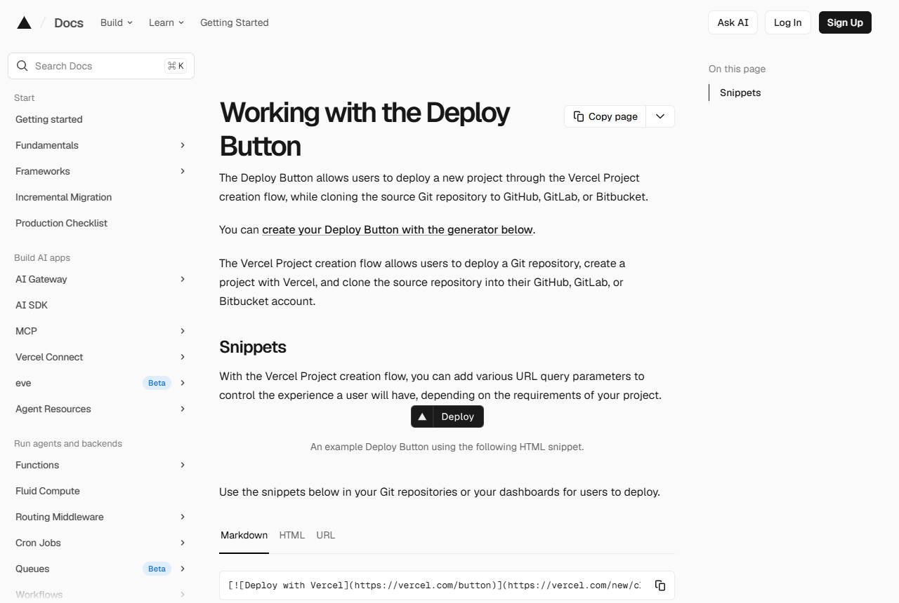
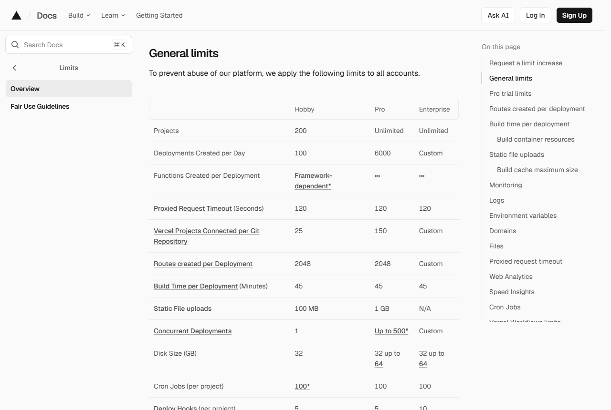

<!-- 제품 이름 확정(2026-09-16): 「이폼사인 방명록」. -->

# 이폼사인 방명록 — Vercel 가입부터 배포까지

이 문서는 고객이 **자기 Vercel 계정**에 이폼사인 방명록 을 올리는 절차를 순서대로 설명한다. 설치본은 고객 계정 안에서만 동작하며, 우리 쪽 서버를 거치지 않는다.

배포 방식은 세 가지다. 이 문서는 ①을 다룬다.

| 방식 | 언제 쓰나 | 문서 |
|---|---|---|
| ① Vercel 「Deploy」 버튼 | 고객이 Vercel 계정을 새로 만들어 쓰는 경우. 가장 단계가 적다 | 이 문서 |
| ② 정적 파일을 고객 자기 웹서버·버킷에 올림 | 사내 인프라 규정상 외부 호스팅을 쓸 수 없는 경우 | [own-domain-https.md](own-domain-https.md) |
| ③ 로컬에서 확인만 | 도입 전 시연·검토 | 저장소 README 「설치·실행」 |

> 캡처한 화면은 2026-09-15 기준이다. Vercel 은 화면을 수시로 바꾸므로 실제 화면이 이 문서와 다를 수 있다. 버튼 이름이 달라도 흐름(저장소 복제 → 환경변수 입력 → 배포)은 같다.

---

## 0. 미리 준비할 것

| 준비물 | 어디서 확인하나 |
|---|---|
| 이폼사인 **외부 작성 URL** | 이폼사인 웹폼 디자이너로 서식을 만들고, 시작 단계 속성에서 **「URL로 문서 생성 허용」을 켠 뒤** 얻는 공개 URL |
| GitHub 계정 | 아래 1단계 |
| Vercel 계정 | 아래 2단계 |

외부 작성 URL 은 다음 형태다. 설정 마법사(`setup.html`)에 이 URL 을 붙여 넣으면 `company_id` 와 `form_id` 를 자동으로 뽑아낸다.

```
https://www.eformsign.com/eform/document/external_user_view_service.html?company_id=<회사 ID>&form_id=<템플릿 ID>&lang_code=ko&country_code=kr
```

🔴 「URL로 문서 생성 허용」이 꺼져 있으면 화면은 뜨지만 서식 본문이 비고 「보고서를 로딩하면서 예외가 발생했습니다」(에러코드 1020030013)만 표시된다. 배포 전에 이 스위치부터 확인한다.

---

## 1. GitHub 계정이 왜 필요한가

「Deploy」 버튼은 단순한 파일 업로드가 아니라 **Vercel 의 프로젝트 생성 흐름**을 여는 링크다. 이 흐름은 원본 저장소를 고객의 GitHub·GitLab·Bitbucket 계정으로 복제한 뒤, 그 복제본을 고객의 Vercel 프로젝트에 연결한다(출처: Vercel 문서 「Working with the Deploy Button」, 2026-09-15 확인).



복제본이 고객 계정에 생기므로 다음이 따라온다.

- 설정을 바꾸거나 화면 문구를 고칠 때 우리에게 요청할 필요가 없다. 고객이 자기 저장소를 고치면 Vercel 이 다시 배포한다.
- 우리가 원본을 고쳐도 고객 설치본은 자동으로 바뀌지 않는다. 갱신이 필요하면 고객에게 알린다.
- GitHub 계정이 없으면 이 방식을 쓸 수 없다. 이 경우 ② 정적 파일 방식으로 간다.

🔴 **무료(Hobby) 계정은 GitHub 조직(Organization) 소유 저장소와 연결되지 않는다.** Vercel 문서 「Limits」의 'Connecting a project to a Git repository' 절이 이를 명시하고 있다(2026-09-15 확인). 회사 GitHub 조직 아래에 복제하려면 Vercel 팀을 Pro 로 두어야 한다. 개인 GitHub 계정 아래에 복제하면 Hobby 로도 된다.

---

## 2. Vercel 가입

Vercel 은 웹 페이지와 애플리케이션을 올려 두는 호스팅 서비스다. 이폼사인 방명록 은 그 위에 정적 파일로 올라간다.


[https://vercel.com/signup](https://vercel.com/signup) 에서 가입한다. Google·GitHub·Apple 계정으로 잇거나 이메일로 가입할 수 있다.


**GitHub 계정으로 가입하는 것을 권한다.** 1단계에서 본 대로 Deploy 버튼이 GitHub 저장소를 복제하므로, 같은 계정으로 이어 두면 중간에 계정을 연결하는 단계가 줄어든다.

가입 자체는 고객이 직접 한다. 계정 생성과 약관 동의는 계정 소유자만 할 수 있는 절차다.

---

## 3. 요금제 — Hobby 로 되는 범위와 안 되는 범위

Vercel 요금제는 Hobby(무료)·Pro·Enterprise 셋이다.


Vercel 은 Hobby 를 다음과 같이 설명한다(vercel.com/pricing, 2026-09-15 확인).

> "The perfect starting place for your web app or personal project."

### 기술적 한도로 보면 충분하다

이폼사인 방명록 은 빌드 산출물이 정적 파일 몇 개이고, 유료 옵션인 일일 리포트를 켜도 하루 한 번 크론이 도는 구조다. 2026-09-15 기준 Hobby 한도는 아래와 같다(vercel.com/docs/limits).

| 항목 | Hobby 한도 | 이 제품이 쓰는 양 |
|---|---|---|
| 프로젝트 수 | 200 | 1 |
| 하루 배포 횟수 | 100 | 설정을 바꿀 때만 |
| 정적 파일 업로드 | 100 MB | 1 MB 미만 |
| 프로젝트당 크론 작업 | 100 | 리포트 옵션을 켜면 1 |



크론은 Hobby 에서 **하루 한 번**까지만 된다. Vercel 문서 「Usage & Pricing for Cron Jobs」(2026-09-15 확인):

> "Hobby accounts are limited to cron jobs that run once per day."

같은 문서가 Hobby 의 실행 시각 정밀도를 '시간 단위(±59분)'로 적고 있다. 즉 매일 오전 1시로 지정해도 실제 실행은 1시에서 1시 59분 사이가 된다. 일일 리포트는 전날 것을 모아 보내는 용도이므로 이 오차가 문제되지 않는다.


### 🔴 약관으로 보면 상업적 이용은 Hobby 대상이 아니다

Vercel 의 「Fair Use Guidelines」(2026-09-15 확인)는 다음과 같이 적고 있다.

> "Hobby teams are restricted to non-commercial personal use only."

같은 절은 상업적 이용을 '프로젝트 제작에 관여한 누군가의 금전적 이익을 위해 쓰이는 배포'로 정의하고, 사이트를 만들거나 운영하는 대가를 받는 경우를 예로 든다.


따라서 정리하면 이렇다.

- **기능·한도 면에서는** Hobby 로 이폼사인 방명록 이 동작한다. 시연·검토·사내 시험 배치는 Hobby 로 충분하다.
- **회사 업무용으로 상시 운영한다면** Vercel 의 상업적 이용 정의에 해당할 여지가 있다. 이 판단은 고객사의 이용 형태에 달려 있으므로, 애매하면 Vercel 지원팀에 직접 확인하도록 안내한다(같은 문서가 그렇게 안내하고 있다). Pro 는 2026-09-15 기준 월 20달러다.

이 문서는 약관 해석을 대신하지 않는다. 판단과 계약은 고객이 Vercel 과 직접 한다.

---

## 4. Deploy 버튼으로 배포

설정 마법사(`setup.html`)에서 값을 채우면 마법사가 Deploy 링크를 만들어 준다. 그 링크를 누르면 Vercel 의 프로젝트 생성 흐름이 열리고, 다음 순서로 진행된다.

🔴 **정정(2026-09-16):** 이전 판에는 「환경변수 값이 미리 채워진 상태로 나온다」고 적혀 있었으나 사실이 아니다. Vercel 의 Deploy 링크는 `env=` 로 환경변수 **이름만** 넘길 수 있고, **값은 미리 채워지지 않는다**. 고객은 그 칸에 값을 직접 넣어야 한다. 그래서 이 제품은 설정을 **`KIOSK_CONFIG` 한 개**로 합쳐, 고객이 **한 번만 붙여 넣으면** 되도록 했다.

1. **Git 공급자 선택** — GitHub·GitLab·Bitbucket 중 하나를 고르고 접근을 허용한다. 만들어질 저장소 이름을 정한다(마법사가 `eformsign-guestbook` 으로 미리 채운다).
2. **Vercel 팀·프로젝트 이름 지정** — 개인 계정(Hobby)이면 기본값 그대로 두면 된다.
3. **환경변수 입력** — 칸은 **`KIOSK_CONFIG` 하나**만 나오고 **비어 있다**. 설정 마법사 6-③ 화면의 「복사」 버튼으로 복사한 한 줄을 그대로 붙여 넣는다.

| 환경변수 | 뜻 |
|---|---|
| `KIOSK_CONFIG` | 설정 전체(회사 ID·서식 ID·문구·모드·대기시간·로고)를 JSON → UTF-8 → base64url 로 인코딩한 한 줄. 설정 마법사가 만든다 |

값이 잘못되면 빌드가 **실패**하고 한국어 사유를 낸다(풀리지 않음 / JSON 아님 / `companyId`·`templateId` 누락).
항목별 `KIOSK_*` 변수는 **고급(수동 설정)** 경로로 남아 있다. 정본은 저장소 README 의 환경변수 절이다. 이 문서와 README 가 다르면 README 를 따른다.

4. **Deploy** 를 누른다. 빌드는 정적 파일을 만드는 것뿐이라 오래 걸리지 않는다.
5. 배포가 끝나면 **`https://<프로젝트이름>.vercel.app`** 형태의 주소가 표시된다. 이 주소가 태블릿에 넣을 주소다. 프로젝트 대시보드의 Domains 에서도 언제든 다시 확인할 수 있다.

> 첫 배포가 오래 멈춰 있으면 배포 상세 화면에서 취소한 뒤 Redeploy 를 한 번 더 누른다. 무료 플랜에서 간헐적으로 나타나는 현상이다.

---

## 5. 설정을 바꿀 때 — 환경변수 수정 후 재배포

이폼사인 방명록 의 동작(모드·대기시간·문구·템플릿)은 전부 환경변수로 정해진다. 바꾸는 절차는 이렇다.

1. Vercel 프로젝트 화면 > **Settings > Environment Variables** 에서 값을 고친다.
2. **Deployments** 탭에서 가장 최근 배포의 메뉴를 열어 **Redeploy** 를 누른다.

🔴 환경변수만 고치고 재배포하지 않으면 반영되지 않는다. 빌드 시점에 환경변수를 읽어 설정 파일을 만드는 구조이기 때문이다.

재배포하면 태블릿은 다음 새로고침 때 새 설정을 받는다. 설정 파일에 캐시 금지 헤더가 걸려 있어 옛 설정을 물고 있지 않는다.

현장에서 **한 대만** 다르게 쓰고 싶으면 설정을 고치지 말고 주소 뒤에 쿼리를 붙인다.

```
https://<프로젝트이름>.vercel.app/?mode=immediate
https://<프로젝트이름>.vercel.app/?mode=thanks&sec=4&idle=60
```

---

## 6. 태블릿에 주소 넣기

배포 주소를 태블릿 브라우저에 넣고 키오스크 모드로 고정한다.

- **Android(Chrome)**: 설정 > 앱 에서 Chrome 을 기본 브라우저로 두고, 화면 고정(앱 고정)을 사용한다. 전용 단말이면 *Fully Kiosk Browser* 같은 키오스크 런처로 시작 주소를 지정하는 쪽이 안정적이다.
- **iPad(Safari)**: 설정 > 손쉬운 사용 > **가이드 접근**을 켜고, Safari 로 페이지를 연 뒤 홈 버튼(또는 측면 버튼)을 세 번 눌러 가이드 접근을 시작한다.
- **Windows 태블릿(Edge)**: `msedge.exe --kiosk https://<프로젝트이름>.vercel.app --edge-kiosk-type=fullscreen`

페이지 자체도 뒤로 가기를 무효화하고, 우클릭과 확대 제스처를 막고, 무응답 시 처음 화면으로 돌아간다.

---

## 7. 배포 직후 확인할 것

- [ ] 배포 주소를 열었을 때 이폼사인 서식 본문이 보인다(빈 화면이나 에러코드 1020030013 이 아니다).
- [ ] 한 건 작성해 전송해 본다. 방문자는 **전송 → 팝업의 전송**으로 두 번 누른다.
- [ ] 이폼사인 콘솔 > **문서 관리**에서 그 문서가 보인다. 외부 URL 작성 문서는 개인 문서함(진행 중·처리할·완료)에는 들어가지 않는다. 문서 관리자 권한이 있는 멤버만 볼 수 있으므로, 담당자를 템플릿의 문서 관리자로 지정해 둔다.
- [ ] 태블릿을 세워 둔 채 대기시간만큼 두어 처음 화면으로 돌아가는지 본다.

---

## 참고 문서

- [own-domain-https.md](own-domain-https.md) — 고객 자기 도메인에 올리는 방법
- [report-option.md](report-option.md) — 일일 리포트 옵션(유료)
