<!-- 제품 이름 확정(2026-09-16): 「이폼사인 방명록」. -->

# 이폼사인 방명록 — 처음 설치하기

이 문서는 **처음 한 번** 하는 설치를 순서대로 적은 것입니다.
어려운 낱말을 쓰지 않았고, 한 절에 할 일 하나만 담았습니다. 위에서부터 차례대로 따라 하시면 됩니다.
다 하는 데 보통 **10분에서 20분** 걸립니다.

만들어진 화면은 **고객 계정 안에서만** 돌아갑니다. 방문자가 적은 내용은 우리 쪽을 거치지 않고 곧장 이폼사인으로 갑니다.

> 아래 그림은 2026-09-15에 찍은 것입니다. 화면은 가끔 바뀌므로 그림과 조금 달라 보일 수 있습니다.
> 그래도 하는 일의 차례는 같으니, 그림과 다르면 **글에 적힌 단추 이름**을 화면에서 찾아 누르세요.

---

## 0. 시작하기 전에 챙길 것

| 챙길 것 | 어떻게 얻나 |
|---|---|
| 이폼사인에서 만든 **서식** | 이폼사인이 제공하는 템플릿을 가져오거나, 웹폼 디자이너로 직접 만들어 발행합니다 |
| 그 서식의 **방문자용 작성 주소** | 아래 1번 |
| 이메일 주소 하나 | 계정을 만들 때 씁니다 |
| 방문자가 쓸 **태블릿** | 인터넷에 연결되어 있으면 됩니다 |

돈이 드는 것은 지금 단계에서는 없습니다. 요금 이야기는 4번에서 합니다.

---

## 1. 서식의 방문자용 작성 주소를 복사합니다

이폼사인에서 만든 서식에는, 로그인하지 않은 사람도 열 수 있는 주소가 하나 있습니다. 그 주소를 가져옵니다.

1. 이폼사인에서 그 서식을 엽니다.
2. 시작 단계 속성에서 **「URL로 문서 생성 허용」을 켭니다.**
3. 그렇게 해서 나온 주소를 통째로 복사합니다. 이런 모양입니다.

```
https://www.eformsign.com/eform/document/external_user_view_service.html?company_id=<회사 ID>&form_id=<서식 ID>&lang_code=ko&country_code=kr
```

주소 안에 들어 있는 회사 번호와 서식 번호는 **설정 마법사가 알아서 꺼내 씁니다.** 직접 찾아 적을 필요가 없습니다.

> **안 돼요 — 화면은 뜨는데 서식 자리가 비어 있고 「보고서를 로딩하면서 예외가 발생했습니다」라고 나옵니다**
> 2번의 「URL로 문서 생성 허용」이 꺼져 있는 것입니다. 그 스위치를 켜고 서식을 다시 발행한 뒤 화면을 새로고침하세요.
> 켰는데도 같으면, 켠 다음에 **다시 발행**을 했는지 확인하세요.
> 그래도 같으면 그 화면을 사진으로 찍어 담당자에게 보내 주세요.

---

## 2. GitHub 계정을 만듭니다

GitHub은 **내 방명록 파일을 내 이름으로 보관해 두는 곳**입니다. 방명록 화면이 여기 있는 파일을 가져다 씁니다.

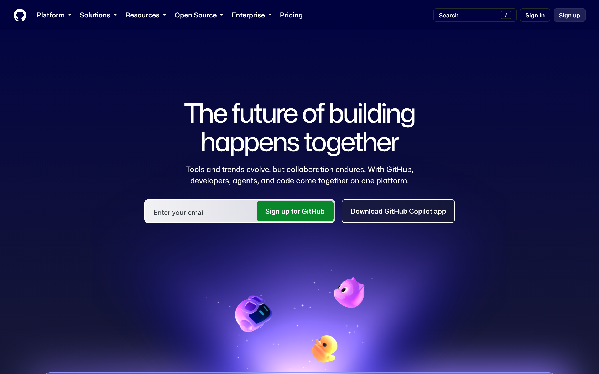

1. [https://github.com/signup](https://github.com/signup) 을 엽니다.
2. 이메일과 새 암호를 넣고 화면이 시키는 대로 넘어갑니다.
3. 받은 편지함에 온 확인 메일의 숫자를 넣으면 끝입니다.

🔴 **회사 공용 계정이 아니라 본인 계정으로 만드세요.** 회사 공용으로 묶인 곳에 파일을 두면 4번에서 말하는 유료 요금제가 처음부터 있어야 합니다.

> **안 돼요 — 「이미 쓰고 있는 이메일입니다」라고 나옵니다**
> 그 이메일로 만든 계정이 이미 있는 것입니다. 새로 만들지 말고 **로그인**으로 들어가 그 계정을 그대로 쓰세요.
> 암호가 기억나지 않으면 로그인 화면의 「암호를 잊으셨나요」로 새로 정하세요.
> 그래도 들어가지지 않으면 다른 이메일로 하나 더 만들고, 담당자에게 알려 주세요.

---

## 3. Vercel 계정을 만듭니다

Vercel은 **만든 화면을 인터넷에 띄워 주는 곳**입니다. 태블릿이 여는 주소가 여기서 나옵니다.

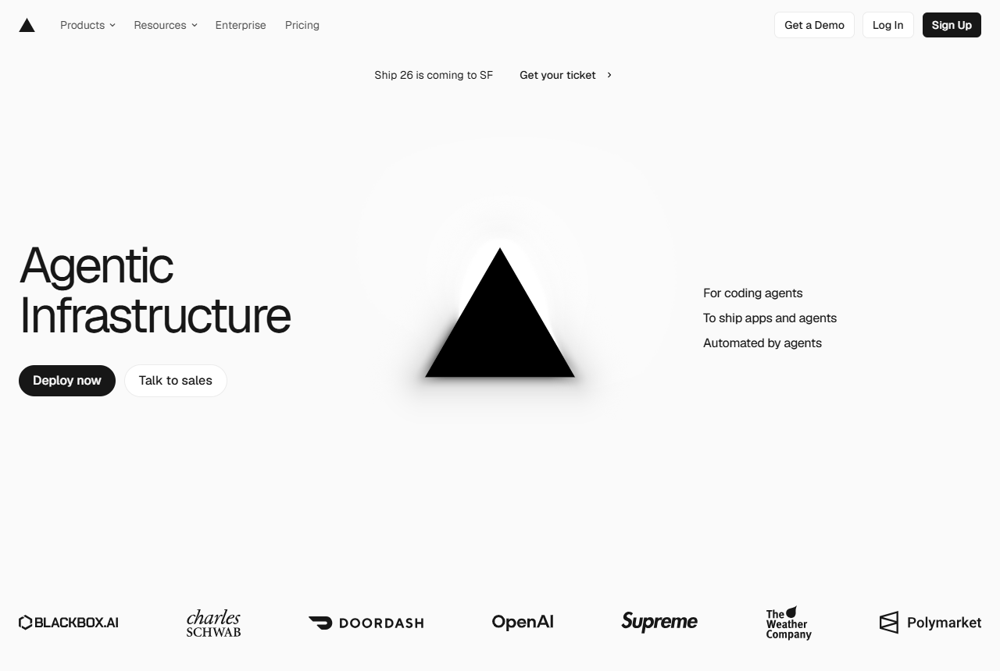

1. [https://vercel.com/signup](https://vercel.com/signup) 을 엽니다.
2. 가운데 목록에서 **GitHub 줄을 누릅니다.** 방금 만든 계정으로 그대로 이어집니다.
3. 권한을 허용하겠냐고 물으면 허용합니다. 내 파일을 가져다 쓰기 위해 필요한 절차입니다.

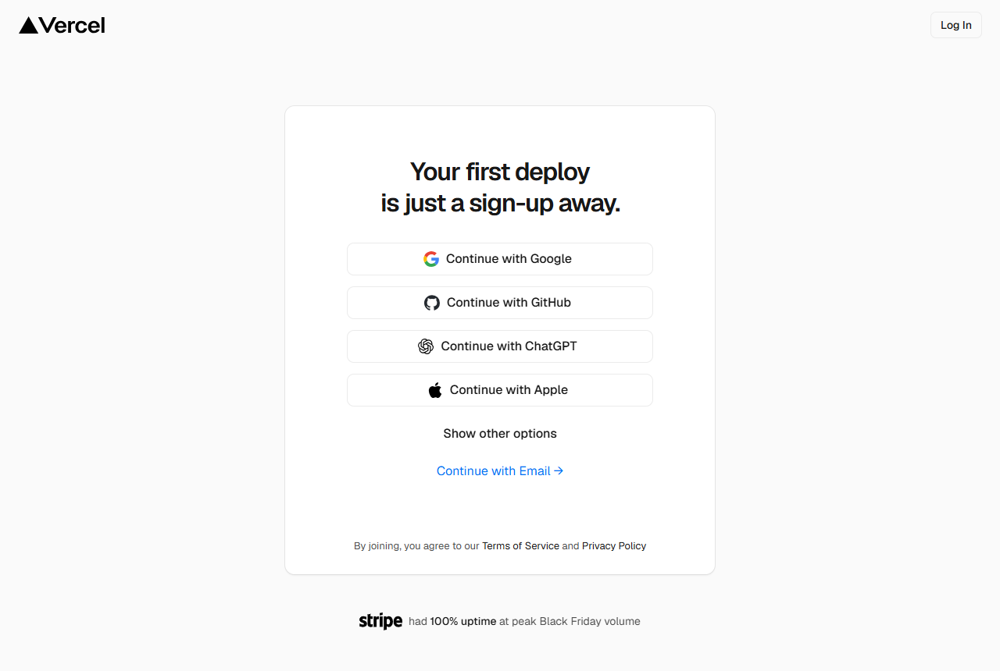

가입은 본인이 직접 해야 합니다. 계정을 만들고 약관에 동의하는 일은 계정 주인만 할 수 있습니다.

> **안 돼요 — 어떤 방법으로 가입할지 모르겠습니다**
> 가운데 목록의 **GitHub 줄**을 누르세요. 2번에서 만든 계정으로 바로 이어져 가장 단계가 적습니다.
> 목록이 보이지 않으면 화면을 아래로 조금 내려 보세요.
> 그래도 없으면 화면을 사진으로 찍어 담당자에게 보내 주세요.

---

## 4. 요금 — 무료로 시작하고, 필요에 따라 고릅니다

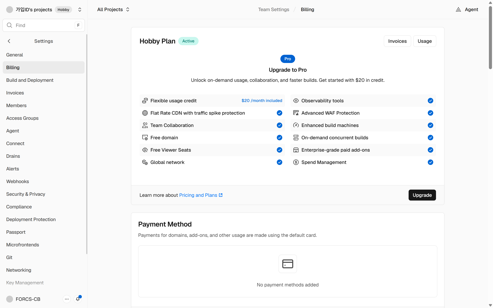

**무료 요금제가 기본입니다.** 돈을 내지 않고 그대로 만들어 볼 수 있고, 계속 쓰는 것도 무료로 됩니다.

Vercel은 무료 요금제를 **개인 용도로만** 쓰도록 정해 두었습니다. 회사 업무로 상시 운영하는 경우라면, 아래 두 가지 중 **형편에 맞는 쪽을 고르면 됩니다.** 어느 한쪽이 더 낫다고 정해진 것은 아닙니다.

- **유료 요금제(Pro)로 바꾸기.** 2026-09-15 기준 Pro는 **쓰는 사람 한 명에 한 달 20달러**입니다. 바꾸는 곳은 Vercel 화면의 **Settings**(설정) 안 요금 항목입니다.
- **회사 서버에 직접 올리기.** 전산 담당자(IT 담당자)가 있으면 Vercel을 거치지 않고 회사 안 서버에 올릴 수도 있습니다. 방법은 [회사 서버에 직접 올리기](own-domain-https.md) 문서를 전산 담당자에게 넘기세요.

Pro로 바꾸는 데 드는 돈은 **Vercel에 직접 내는 것**이며, 이폼사인 방명록 이용료와는 별개입니다.

무료 요금제로는 **회사 공용으로 묶인 곳에 있는 파일을 연결할 수 없습니다.** 본인 계정에 두면 무료로도 그대로 됩니다.

지금 정하지 않아도 설치는 그대로 진행됩니다. 언제든 나중에 바꿀 수 있습니다.

<details>
<summary>어디에 그렇게 적혀 있나 — 근거를 보고 싶을 때</summary>

Vercel 「Fair Use Guidelines」(2026-09-15 확인)에 무료 요금제는 상업적이지 않은 개인 용도로만 쓴다고 적혀 있습니다.

> "Hobby teams are restricted to non-commercial personal use only."

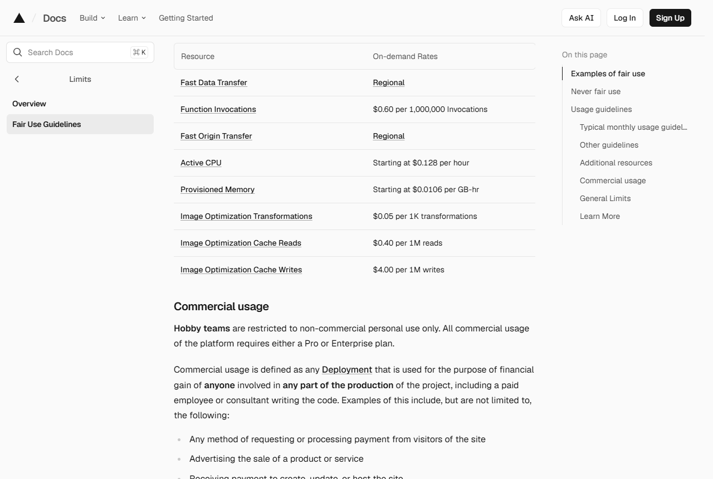

Vercel 「Limits」 문서(2026-09-15 확인)의 'Connecting a project to a Git repository' 절에 무료 요금제로는 회사 공용으로 묶인 곳의 파일을 연결할 수 없다고 적혀 있습니다.

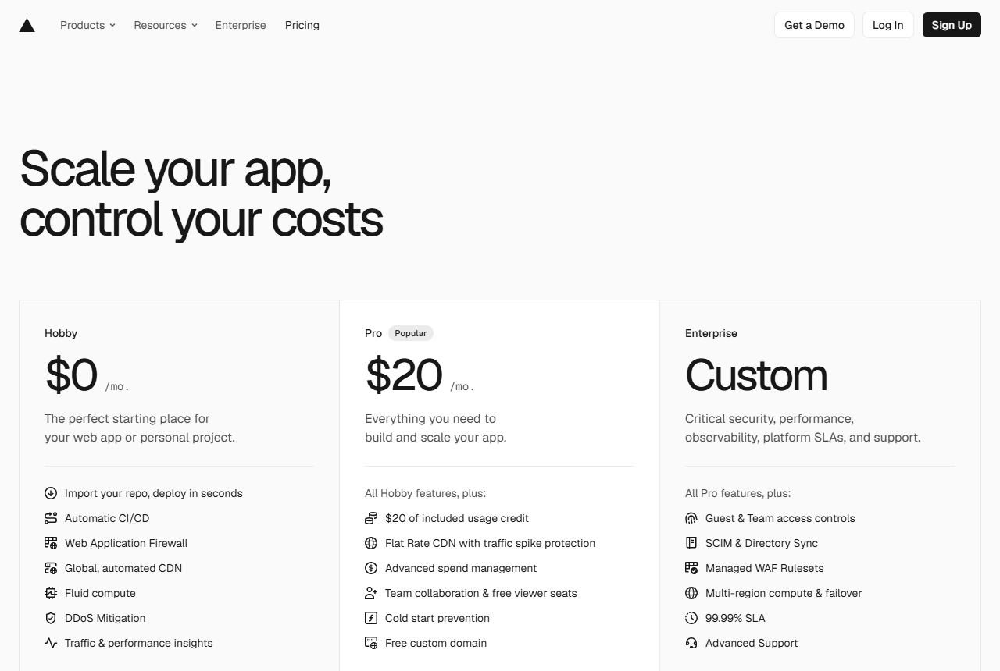

이 문서가 약관 해석을 대신하지는 않습니다. 애매하면 Vercel에 직접 물어보시면 되고, 계약은 고객과 Vercel 사이의 일입니다.

</details>

> **안 돼요 — 어느 것을 골라야 할지 모르겠습니다**
> 지금 해 보는 단계면 **무료**를 고르세요. 나중에 언제든 바꿀 수 있습니다.
> 회사 업무로 상시 운영하기로 정했다면, 전산 담당자가 있는지에 따라 **Pro** 또는 **회사 서버 올리기** 중 하나를 고르면 됩니다.
> 사내 규정 때문에 판단이 어려우면 담당자에게 이 절을 그대로 보여 주고 물어보세요.

---

## 5. 설정 마법사에서 설치를 시작합니다

설정 마법사(`setup.html`)를 열고, 1단계부터 5단계까지 채웁니다.

1. 1~2단계에 **1번에서 복사한 주소**를 붙여 넣습니다. 마법사가 그 자리에서 서식 상태를 봐 줍니다.
2. 3~4단계에서 화면 제목, 다음 사람 화면이 뜨기까지 기다리는 시간 같은 것을 정합니다.
3. 5단계의 요약을 읽고 **「설치 시작하기」**를 누릅니다.

누르면 새 창이 열립니다. 이 창에서 6번과 7번을 합니다.

> **안 돼요 — 「설치 시작하기」를 눌렀는데 새 창이 열리지 않습니다**
> 브라우저가 새 창을 막은 것입니다. 주소를 적는 칸 오른쪽 끝에 뜬 안내를 눌러 허용한 뒤 다시 누르세요.
> 그래도 안 열리면 마법사 화면을 닫지 말고 담당자에게 알려 주세요. 화면을 닫으면 지금까지 채운 값이 사라집니다.

---

## 6. 이름을 정하고 만듭니다

새로 열린 창에서 **내 계정에 방명록 파일을 한 벌 복사해 둡니다.**

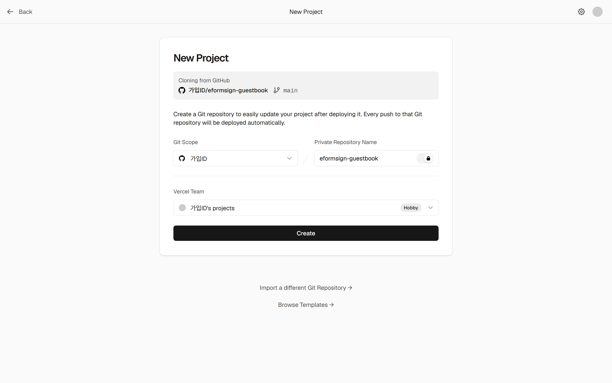

1. 이름 칸에 `eformsign-guestbook`이 미리 적혀 있습니다. 그대로 두면 됩니다.
2. 화면 오른쪽 아래의 `Create` 단추를 누릅니다.

> **안 돼요 — 이름 칸에 빨간 글씨가 뜹니다**
> 같은 이름이 이미 있는 것입니다. 이름 뒤에 숫자를 하나 붙여 `eformsign-guestbook2`처럼 고친 뒤 다시 누르세요.
> 그래도 빨간 글씨가 남으면 이름에 한글이나 빈칸이 들어가지 않았는지 보세요.
> 계속 같으면 화면을 사진으로 찍어 담당자에게 보내 주세요.

---

## 7. 설정값 한 줄을 붙여 넣습니다

이 화면에는 **빈 칸 하나**가 나옵니다. 여기에 마법사가 만들어 준 한 줄을 넣습니다.

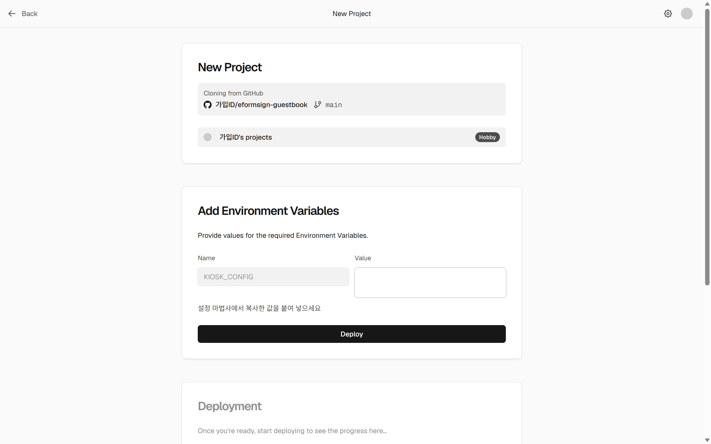

1. 마법사 화면으로 돌아가 **「복사」** 단추를 누릅니다.
2. 이 화면의 `KIOSK_CONFIG` 칸을 누르고 붙여 넣습니다.
3. 붙여 넣으면 아래 그림처럼 긴 글자가 칸을 채웁니다.

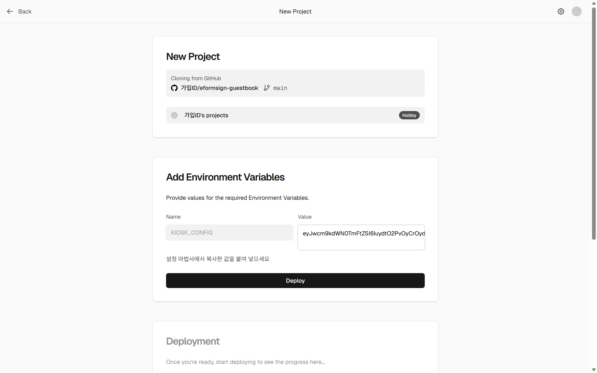

4. 아래의 `Deploy` 단추를 누릅니다. 설치 준비가 잠깐 돌고 끝납니다.

이 한 줄 안에 회사 번호·서식 번호·화면 문구·기다리는 시간·로고가 모두 들어 있습니다. 그래서 칸이 하나뿐입니다.

> **안 돼요 — 「복사」를 눌러도 아무 일도 없는 것 같습니다**
> 마법사 화면의 검은 칸 안을 마우스로 끌어 전체를 고른 뒤 `Ctrl` 키와 `C` 키를 함께 누르세요.
> 값이 아주 길어 보이는 것은 원래 그렇습니다. **손으로 옮겨 적지 말고 반드시 복사해서** 붙여 넣으세요.
> 붙여 넣은 뒤에도 칸이 비어 보이면 화면을 한 번 새로고침하고 다시 해 보세요.

> **안 돼요 — 빨간 글씨와 함께 멈췄습니다**
> 넣은 값이 중간에 끊겼거나 한 글자가 빠진 것입니다. 메시지에 한국어로 이유가 나옵니다.
> 마법사에서 다시 복사해 칸을 **비우고 새로** 붙여 넣은 뒤 `Deploy`를 다시 누르세요.
> 두 번 해도 같으면 그 빨간 글씨를 사진으로 찍어 담당자에게 보내 주세요.

---

## 8. 만들어진 주소를 확인합니다

끝나면 `https://<정한이름>.vercel.app` 모양의 주소가 화면에 뜹니다. **이 주소가 태블릿에 넣을 주소입니다.**

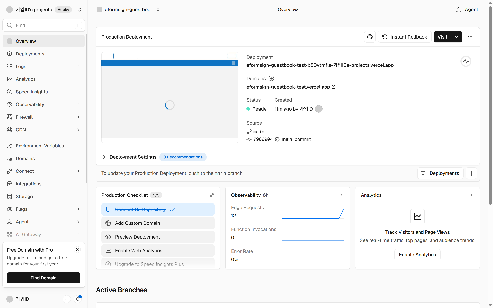

나중에 다시 보고 싶으면 Vercel 화면의 **Domains** 항목에서 언제든 확인할 수 있습니다.

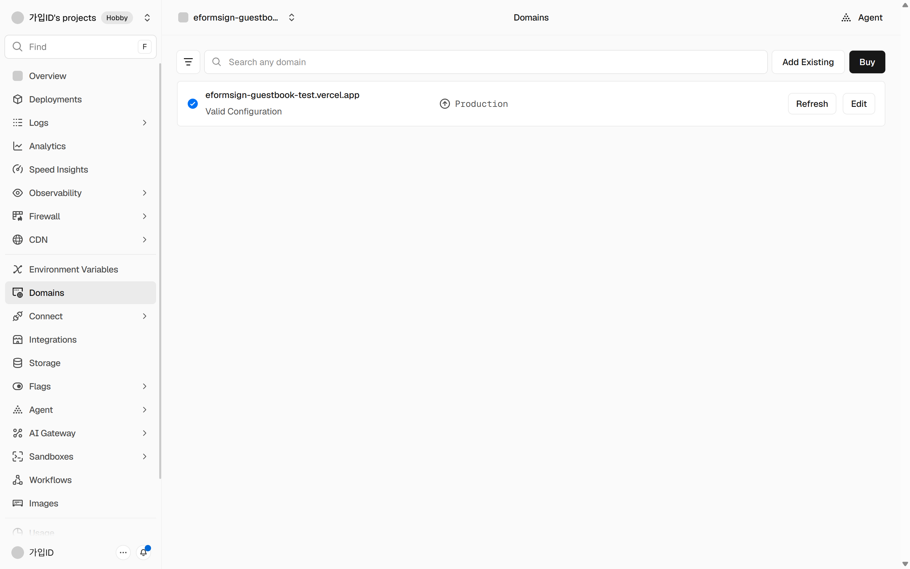

> **안 돼요 — 화면이 한참 돌기만 하고 끝나지 않습니다**
> 가끔 있는 일입니다. 그 화면에서 한 번 취소한 뒤, 목록의 맨 위 줄 오른쪽 점 세 개를 눌러 `Redeploy`(다시 설치)를 한 번 더 누르세요.
> 두 번 해도 같으면 화면을 사진으로 찍어 담당자에게 보내 주세요.

---

## 9. 태블릿에 주소를 넣습니다

태블릿 브라우저에 8번의 주소를 넣고, 다른 화면으로 못 빠져나가게 고정합니다.

- **안드로이드 태블릿**: 크롬으로 주소를 연 다음 **화면 고정(앱 고정)**을 켭니다. 방명록 전용 기기라면 *Fully Kiosk Browser* 같은 프로그램에 시작 주소를 넣어 두는 쪽이 더 안정적입니다.
- **아이패드**: 설정 > 손쉬운 사용 > **가이드 접근**을 켜고, 사파리로 주소를 연 뒤 옆 단추를 세 번 눌러 시작합니다.
- **윈도우 태블릿**: 엣지 바로가기를 만들고, 그 속성의 대상 뒤에 `--kiosk https://<정한이름>.vercel.app --edge-kiosk-type=fullscreen`을 붙입니다.

화면 자체도 뒤로 가기를 막고, 오른쪽 단추 메뉴와 두 손가락 확대를 막고, 한동안 아무도 만지지 않으면 처음 화면으로 돌아갑니다.

> **안 돼요 — 방문자가 화면을 빠져나가 다른 앱을 엽니다**
> 화면 고정이 켜지지 않은 것입니다. 태블릿 설정에서 화면 고정을 다시 켜고, 끌 때 암호를 묻도록 해 두세요.
> 기종마다 이름이 달라 찾기 어려우면 태블릿 모델 이름과 함께 담당자에게 물어보세요.

---

## 10. 설치 직후 확인표

- [ ] 태블릿에서 주소를 열었을 때 **서식 본문이 보인다**(빈 화면이나 오류 창이 아니다).
- [ ] 한 건 채워 보낸다. 방문자는 **「전송」을 누르고, 뜬 창에서 한 번 더** 누릅니다.
- [ ] 이폼사인의 **문서 관리** 화면에 그 문서가 보인다.
- [ ] 태블릿을 그냥 두었을 때 정한 시간 뒤 **처음 화면으로 돌아간다.**

🔴 방문자용 주소로 들어온 문서는 담당자 개인 문서함(진행 중·처리할·완료)에 **들어가지 않습니다.**
문서 관리 권한이 있는 사람만 볼 수 있으니, 담당자를 그 서식의 **문서 관리자로 지정**해 두세요.
매일 아침 정리해서 받아 보고 싶으면 [report-option.md](report-option.md)를 보세요.

> **안 돼요 — 보냈는데 문서 관리 화면에 보이지 않습니다**
> 먼저 화면 위쪽의 기간을 **오늘**로 맞추고 새로고침해 보세요.
> 그래도 없으면 지금 로그인한 사람이 그 서식의 문서 관리자인지 확인하세요.
> 둘 다 맞는데 없으면 보낸 시각과 서식 이름을 적어 담당자에게 알려 주세요.

---

## 11. 나중에 설정을 바꿀 때

화면 문구, 기다리는 시간, 쓰는 서식은 모두 7번에서 넣은 **한 줄**로 정해집니다. 바꾸는 방법은 두 가지입니다.

**(가) 마법사로 다시 만들기 — 권합니다.** 설정 마법사를 다시 열어 값을 고치고, 새로 나온 한 줄을 아래 순서로 갈아 끼웁니다.

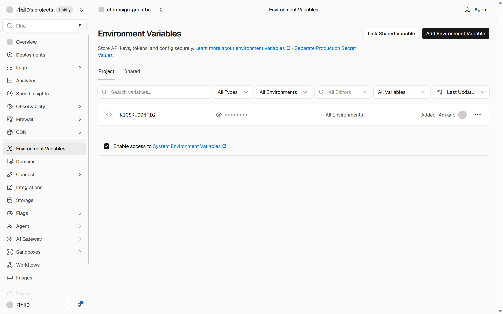

1. Vercel 화면의 **Settings > Environment Variables**에서 `KIOSK_CONFIG` 값을 새 것으로 바꿉니다.
2. **Deployments** 목록에서 맨 위 줄 오른쪽 점 세 개를 눌러 `Redeploy`(다시 설치)를 누릅니다.

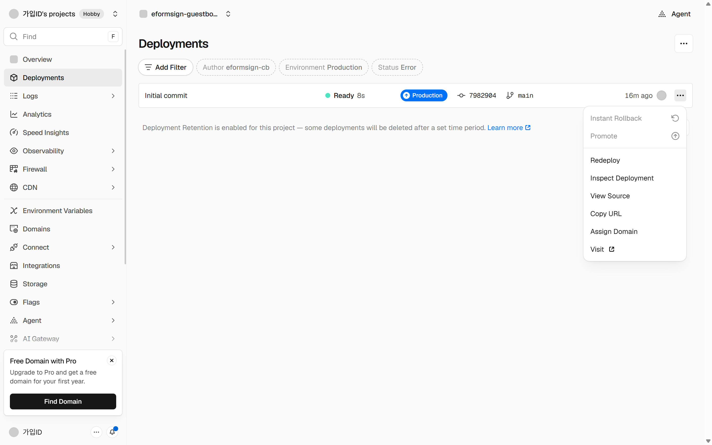

🔴 **값만 고치고 2번을 하지 않으면 태블릿에는 그대로입니다.** 값을 읽어 화면을 다시 만드는 시점이 이때이기 때문입니다.
다시 만들고 나면 태블릿은 다음 새로고침 때 새 설정을 받습니다.

**(나) 태블릿 한 대만 다르게 쓰기.** 설정을 건드리지 말고 주소 뒤에 다음을 붙여 그 태블릿에서만 열면 됩니다.

```
https://<정한이름>.vercel.app/?mode=immediate
https://<정한이름>.vercel.app/?mode=thanks&sec=4&idle=60
```

> **안 돼요 — 고쳤는데 태블릿이 예전 그대로입니다**
> 위 2번(다시 설치)을 했는지 먼저 보세요. 목록 맨 위 줄의 시각이 방금이면 제대로 된 것입니다.
> 그다음 태블릿 화면을 한 번 새로고침하세요.
> 둘 다 했는데 같으면 태블릿을 껐다 켜 보세요. 그래도 같으면 담당자에게 알려 주세요.

---

## 12. 그래도 안 되면

여기까지 해도 막히면, 아래 세 가지만 적어 담당자에게 보내 주세요. 대부분 바로 답을 드릴 수 있습니다.

1. **몇 번 단계**에서 멈췄는지
2. 그 화면을 찍은 **사진**
3. 화면에 뜬 **글자 그대로**(빨간 글씨가 있으면 특히)
